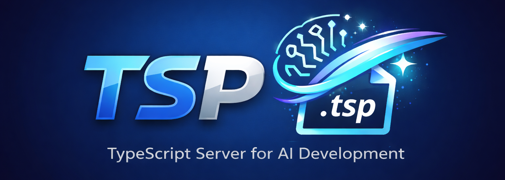

# TSP



A TypeScript server that executes `.tsp` files directly like PHP, designed for AI-driven development.

## Features

- **Simple to Use** - Execute `.tsp` files directly like PHP
- **Smart Caching** - File modification time-based module caching with excellent performance
- **Hot Reload** - Support for hot reloading with nested dependencies at any depth
- **Secure** - Comprehensive path checking and permission control
- **Full-featured** - Query parameters, POST data, Cookies, redirects, and more
- **Component-based** - Using TSX + React, supporting modern frontend component development
- **Type-safe** - Complete TypeScript type support, Schema-first database API
- **File Manager** - Built-in web file manager with password protection
- **Config Auto-reload** - Configuration changes take effect automatically without restart
- **Static Files** - Support for HTML, CSS, JS, images, and other static files
- **Port Management** - Automatically detect and clean up processes occupying ports
- **Database Integration** - Schema-first MySQL/Redis/LDAP support, type-safe database queries

## Quick Start

### Option 1: Download Pre-built Release (Recommended)

Download the latest release from [GitHub Releases](https://github.com/risol/tsp/releases):

```bash
# Download and extract (replace with your platform)
curl -L https://github.com/risol/tsp/releases/latest/download/tsp-linux-x64.tar.gz -o tsp.tar.gz
tar -xzf tsp.tar.gz
cd tsp-linux-x64

# Start the server
./tspserver --root ./www --port 9000
```

### Option 2: Build from Source

If you want to build from source, you need Rust and C build tools:

```bash
# Clone the repository (with submodules)
git clone --recursive https://github.com/risol/tsp.git
cd tsp

# Or if already cloned, init submodules
git submodule update --init --recursive

# Build deno-tsp runtime
sh ./tsp.sh build:denort
sh ./tsp.sh build:deno

# Start development server
sh ./tsp.sh dev

# Start production mode
sh ./tsp.sh start
```

### 3. Access the Application

Open browser and visit `http://localhost:9000`

## Build from Source (Advanced)

Most users should download pre-built releases instead. Building from source requires:

- Rust toolchain
- C compiler (gcc/clang)
- For Linux static builds: sysroot (auto-downloaded)

```bash
# Build release binary for current platform
sh ./tsp.sh build:tspserver

# Build debug binary
sh ./tsp.sh build:tspserver:dev

# Build release binary (alias)
sh ./tsp.sh build:tspserver:rel
```

Build output is in the `dist/` directory.

## Docker Test Services

The project includes Docker Compose configuration for quickly starting MySQL and Redis services needed for testing.

See [DOCKER_SERVICES.md](docker/DOCKER_SERVICES.md)

## Documentation

- [Getting Started](./docs/getting-started) - Quick start guide
- [Development Guide](./docs/development) - Development setup
- [Configuration](./docs/configuration) - Server configuration
- [Features](./docs/features) - Feature documentation
- [Testing](./docs/testing) - Testing guide
- [Changelog](./docs/changelog) - Version change log
