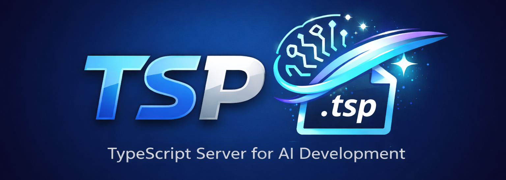

# TSP — TypeScript Server Page



[](https://github.com/risol/tsp/actions/workflows/ci.yml)
[](https://github.com/risol/tsp/releases)

TSP is a native Rust HTTP runtime that embeds Bun in worker child processes
for executing `.tsp` route modules. It uses explicit HTTP method exports and
does not use the former `Page()`/React application host.

## Quick start

Requirements:

- Rust toolchain required by `bun/Cargo.toml`
- Bun 1.x for building the embedded worker
- Git with submodules when starting from a fresh checkout

Build the runtime package:

```bash
git clone --recursive https://github.com/risol/tsp.git
cd tsp
./tsp.sh build
```

Build a Linux x64 `tspserver` entirely inside Docker. The container uses
the same Bun, Rust nightly, and LLVM versions as the Linux GitHub Actions
release job, so a Windows or macOS host does not need the native build
toolchain:

```bash
# Optional: build the reusable compiler environment once.
bash docker/build-builder-image.sh

# Compile the server using that environment.
bash docker/build-linux.sh
```

The executable is written to `dist/tspserver-linux-x64/tspserver`. To build the
runtime image after compiling it, use:

```bash
bash docker/build.sh
```

Run the development server:

```bash
./tsp.sh dev
```

The server listens on port `9000` by default and loads routes from `pages/`.
Route changes are watched and published without restarting the host.

## Route contract

Routes are `.tsp` modules. They export HTTP method handlers and may import the
reserved modules `tsp:server` and `tsp:html`.

```tsx
import { type Context, type PageConfig } from "tsp:server";

export const config = {
  cache: "no-store",
} satisfies PageConfig;

export function GET(ctx: Context) {
  return <h1>Hello from {ctx.url.pathname}</h1>;
}
```

The context exposes the request, URL, route parameters, query parameters,
cookies, session, services, abort signal, and route metadata. Handlers may
return JSX, strings, or `Response` values created with `json`, `html`, `text`,
`redirect`, or `notFound` from `tsp:server`.

Dynamic routes use filesystem segments such as `pages/users/[id].tsp`.
Static assets belong under `public/` and are served independently from route
modules.

## Configuration

The native host is configured through environment variables:

```text
TSP_PORT=9000
TSP_ROUTES_DIR=./pages
TSP_PUBLIC_DIR=./public
TSP_EMBEDDED_WORKER=1
TSP_WORKER_COUNT=2
```

See `./tsp.sh --help` and `tspserver --help` for worker recycling,
timeouts, Redis sessions, cgroup limits, and diagnostics.

## Commands

```bash
./tsp.sh build          # Build the single-file runtime and dist/tspserver package
./tsp.sh build:host     # Copy the built runtime to dist/tspserver
./tsp.sh build:worker   # Build the single-file runtime
./tsp.sh start          # Run the packaged server
./tsp.sh dev            # Run with route hot reload
./tsp.sh check          # cargo check for the host
./tsp.sh test           # Rust tests plus embedded-worker smoke test
./tsp.sh test:rust      # Rust unit and Worker IPC tests
./tsp.sh test:smoke     # HTTP, metrics, and hot-reload smoke test
./tsp.sh package        # Package the single runtime binary
```

## Repository layout

```text
.
├── bun/src/runtime/tsp/       Native host, router, watcher, services, worker
├── pages/                    Application route fixtures
├── public/                    Optional static assets
├── tests/smoke/            End-to-end route fixture
├── scripts/                   Build, package, benchmark, and smoke workflows
├── docs/reference/          Contract and examples
├── types/                   TypeScript declarations for builtin modules
└── tsp.sh                   Root workflow wrapper
```

The specification is in [`tsp-specification.md`](./tsp-specification.md).
The application contract is [`docs/reference/contract.md`](./docs/reference/contract.md).
The embedded worker deployment guide is [`docs/worker.md`](./docs/worker.md).

## License

TSP is released under the MIT License.
